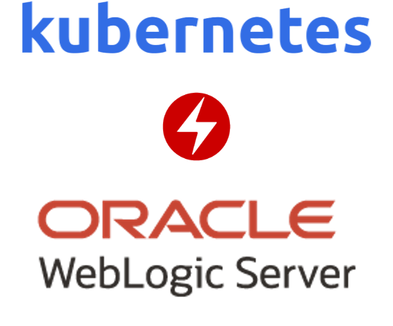
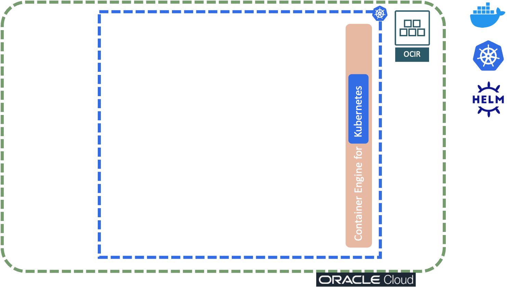
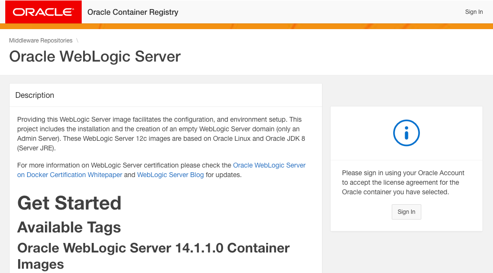
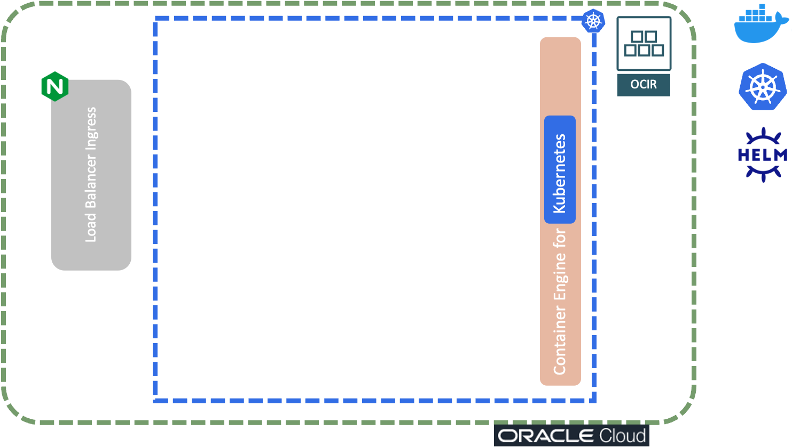
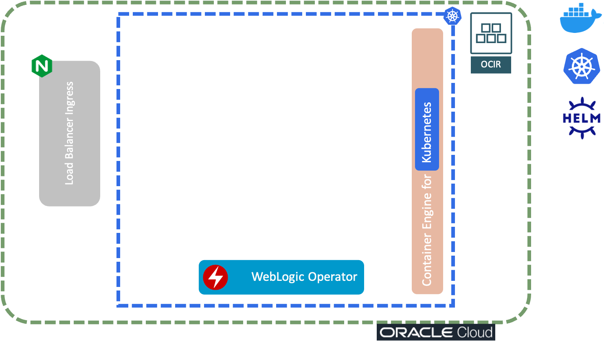
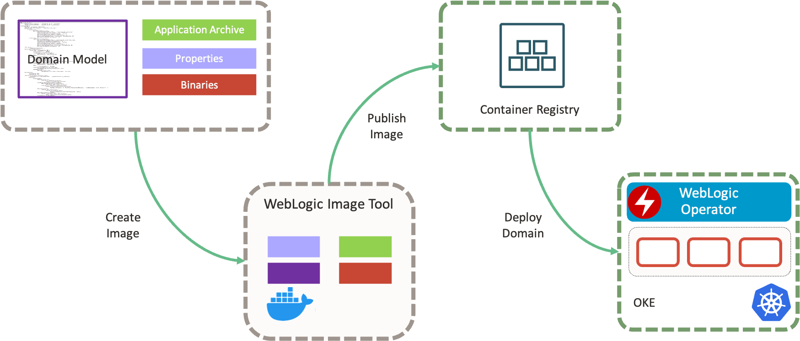
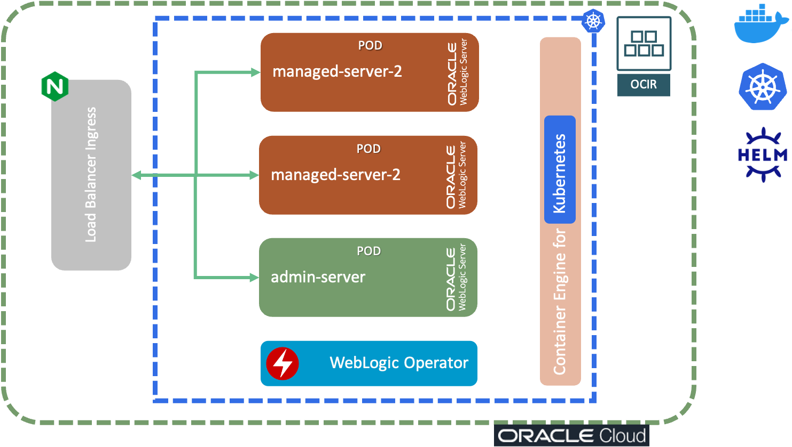

# How Can You Run WebLogic on Kubernetes Smoothly?



WebLogic can fit nicely in the cloud-native landscape nowadays, with the help of [WebLogic Kubernetes Operator](https://oracle.github.io/weblogic-kubernetes-operator/). How to set up WebLogic Domain in Kubernetes? How to containerize the domain? How to scale? Continue reading and explore highlights of WLS on k8s, together with a toolset that will make your ops manageable.

You can use one of the following methods for domain generation:
- Domain Home in K8s Persisten Volume
- Domain Home in Image
- Model in Image

## Introduction
This guide assumes you have basic skills and knowledge about:
   - Docker CLI and containers (basic)
   - Oracle Cloud Infrastructure (basic)
   - Kubernetes and OKE (intermediate)
   - Image registry OCIR (basic)
   - WebLogic administration (intermediate)

Make sure you have:
1. Docker [installed](https://docs.docker.com/get-docker/) locally.
2. Kubernetes cluster provisioned and ready. I will use [OKE](https://docs.oracle.com/en-us/iaas/Content/ContEng/Concepts/contengoverview.htm) provisioned on OCI.
3. ```kubectl``` installed locally. You can follow the [installation docs](https://kubernetes.io/docs/tasks/tools/) and configure it by following [the guide](https://docs.oracle.com/en-us/iaas/Content/ContEng/Tasks/contengdownloadkubeconfigfile.htm#localdownload).
4. Access to OCIR and the ability to push and pull container images. Please follow the [official guide](https://docs.oracle.com/en-us/iaas/Content/Registry/Tasks/registrypullingimagesfromocir.htm)
5. Helm installed locally (package manager for K8s applications). It's required to install WebLogic Operator. Please follow the official [guide](https://helm.sh/docs/intro/install/).

We start with provisioned OKE and OCIR ready to host images, depicted in picture below.



Familiarize yourself with [WebLogic Kubernetes Operator](https://oracle.github.io/weblogic-kubernetes-operator/) and proceed with Installation.

## Prepare Environment

1. Visit [container-registry.oracle.com](https://container-registry.oracle.com/), log in with your Oracle Account, and accept terms on the right side of the screen.
   
2. Login with Docker CLI on container-registry.oracle.com, using the same Oracle Account. You will need it to retrieve the base WebLogic image.
   ```console
   docker login container-registry-frankfurt.oracle.com
   ```
3. Pull WebLogic from the upper reposiotry locally, so the build preocess can use it.
   ```console
   docker pull container-registry-frankfurt.oracle.com/middleware/weblogic:14.1.1.0-11
   ```
4. Login with Docker CLI to OCIR. You will need OCIR to store final WebLogic image with the domain.
   ```console
   docker login eu-frankfurt-1.ocir.io
   ```

## Install Ingress Nginx Controller
Ingress makes Kubernetes deployments very easy and fluid. You set the rules, domains, subdomains, and paths for each deployment. Ingress holds a significant place in Kubernetes architecture because of deployment decoupling from the network and IP management. It's implemented with popular reverse-proxies to handle the inbound requests and route them to the proper deployments and pods. Here, we will use [Nginx Ingress Controller](https://kubernetes.github.io/ingress-nginx/). You can follow the [official install guide](https://docs.oracle.com/en-us/iaas/Content/ContEng/Tasks/contengsettingupingresscontroller.htm#settingupcontroller), or follows the steps below.



1. Since my environment is a shared with multiple users, I need to support multiple ingress controllers. You probably don't need that, so you can follow the official install guide. I decided to copy the content of ```https://raw.githubusercontent.com/kubernetes/ingress-nginx/controller-v1.2.0/deploy/static/provider/cloud/deploy.yaml``` into a file [ingress-nginx.yaml](manifests/ingress-nginx.yaml). I have modified the value of `namespace`, `controller-class`, and `ingress-class` prefixing it with `cloud-coaching` to support multiple ingress controlles in the cluster.
2. After the manifest is ready for deployment, execute:
   ```console
   kubectl apply -f manifests/ingress-nginx.yaml
   ```
3. Check if Nginx pods are running. Please note that my namespace `cloud-coaching-ingress-nginx` is defined in the [ingress-nginx.yaml](manifests/ingress-nginx.yaml)
   ```console
   kubectl get pods -n cloud-coaching-ingress-nginx
   ```
   You should get a response similar to the one below.
   ```console
   NAME                                        READY   STATUS      RESTARTS   AGE
   ingress-nginx-admission-create-zl5r7        0/1     Completed   0          131m
   ingress-nginx-admission-patch-qz9xs         0/1     Completed   0          131m
   ingress-nginx-controller-6d565df6fb-ptlsf   1/1     Running     0          131m
   ```

## Install WebLogic Operator
We will create a K8s namespace and deploy WebLogic Operator in it.



1. Create Kubernetes Namespace for WebLogic Kubernetes Operator:
    ```console
    kubectl create namespace cloud-coaching-weblogic-operator-ns
    ```
2. Create Service Account for the Operator:
    ```console
    kubectl create serviceaccount -n cloud-coaching-weblogic-operator-ns cloud-coaching-weblogic-operator-sa
    ```
3. Add WebLogic Kubernetes Operator charts repository to Helm:
    ```console
    helm repo add weblogic-operator https://oracle.github.io/weblogic-kubernetes-operator/charts --force-update
    ```
4. Use Helm, to install WebLogic Kubernetes Operator from the repository you have added in the step 3:
    ```console
    helm install cloud-coaching-weblogic-operator weblogic-operator/weblogic-operator \
      --namespace cloud-coaching-weblogic-operator-ns \
      --set image=ghcr.io/oracle/weblogic-kubernetes-operator:3.4.0 \
      --set serviceAccount=cloud-coaching-weblogic-operator-sa \
      --set "enableClusterRoleBinding=true" \
      --set "domainNamespaceSelectionStrategy=LabelSelector" \
      --set "domainNamespaceLabelSelector=cloud-coaching-weblogic-operator\=enabled" \
      --wait
    ```
5. You should get a confirmation from Helm like this:
    ```console
    NAME: cloud-coaching-weblogic-operator
    LAST DEPLOYED: Mon Jun  6 16:00:06 2022
    NAMESPACE: cloud-coaching-weblogic-operator-ns
    STATUS: deployed
    REVISION: 1
    TEST SUITE: None
    ```
6. Check the installation by inspecting pods in the targeted namespace. All operator pods should be in a RUNNING state.
    ```console
    kubectl get pods -n cloud-coaching-weblogic-operator-ns
    ```
    The result will be similar to:
    ```console
    NAME                                 READY   STATUS    RESTARTS   AGE
    weblogic-operator-5c87797869-9nl7g   1/1     Running   0          8m33s
    ```
7. If you inspect Helm installations, you will see it as installed in the specified namespace:
    ```console
    helm list -n cloud-coaching-weblogic-operator-ns
    ```
   
## Build Image With Domain Model
Model in Image implies you have domain model prepared, together with Java EE application. Weblogic Kubernetes Toolkit ensures Image Tool combines WebLogic binaries with domain model and application archives. The process is depicted in the picture below.



1. Go to the folder
    ```console
    cd model-in-image/model-images
    ```
2. Download weblogic-deploy.zip in the current folder:
    ```console
    curl -m 120 -fL https://github.com/oracle/weblogic-deploy-tooling/releases/latest/download/weblogic-deploy.zip -o ./weblogic-deploy.zip
    ```
3. Download imagetool.zip in the current folder and unzip it:
    ```console
    curl -m 120 -fL https://github.com/oracle/weblogic-image-tool/releases/latest/download/imagetool.zip -o ./imagetool.zip
    unzip imagetool.zip
    ```
4. Clear cache, if there is one previously generated:
   ```console
   ./imagetool/bin/imagetool.sh cache deleteEntry --key wdt_latest
   ```
5. Install WIT and reference WDT:
   ```console
   ./imagetool/bin/imagetool.sh cache addInstaller --type wdt --version latest --path ./weblogic-deploy.zip
   ```
6. Go in folder with WAR source:
   ```console
   cd ../archives/archive-v1/
   ```
7. Zip the archive:
   ```console
   zip -r ../../model-images/playground-model/archive.zip wlsdeploy
   ```
8. Go in the folder with model images:
   ```console
   cd ../../model-images
   ```
9. Build the image with inputs:
   ```console
   ./imagetool/bin/imagetool.sh update \
   --tag cloud-coaching-demo-app:1.0 \
   --fromImage container-registry-frankfurt.oracle.com/middleware/weblogic:14.1.1.0-11 \
   --wdtModel      ./playground-model/playground.yaml \
   --wdtVariables  ./playground-model/playground.properties \
   --wdtArchive    ./playground-model/archive.zip \
   --wdtModelOnly \
   --wdtDomainType WLS \
   --chown oracle:root
   ```
10. You will se a confirmation:
    ```console
    Build successful. Build time=82s. Image tag=cloud-coaching-demo-app:1.0
    ```
11. Check the existence of a freshly generated container image with the domain inside:
    ```console
    docker images | grep cloud-coaching-demo-app
    ```
12. Tag the image with the proper OCIR data, samilarly to below:
    ```console
    docker tag cloud-coaching-demo-app:1.0 <region>.ocir.io/<namespace>/oracle/cloud-coaching-demo-app:1.0
    docker tag cloud-coaching-demo-app:1.0 eu-frankfurt-1.ocir.io/frsxwtjslf35/oracle/cloud-coaching-demo-app:1.0
    ```
13. Make sure you are logged in to OCIR:
    ```console
    docker login eu-frankfurt-1.ocir.io
    ```
14. Push the image to OCIR. You will need to make sure
    ```console
    docker push <region>.ocir.io/<namespace>/oracle/cloud-coaching-demo-app:1.0
    docker push eu-frankfurt-1.ocir.io/frsxwtjslf35/oracle/cloud-coaching-demo-app:1.0
    ```

## Deploy WebLogic Domain to Kubernetes with Operator
It's time to deploy WebLogic domain using WebLogic Kubernetes Operator.



1. Create K8s namespace for WebLogic Domain:
    ```console
    kubectl create namespace cloud-coaching-weblogic-domain-ns
    ```
2. Label freshly created namespace with ```cloud-coaching-weblogic-operator=enabled```
    ```console
    kubectl label ns cloud-coaching-weblogic-domain-ns cloud-coaching-weblogic-operator=enabled
    ```
3. Upgrade ```demo-weblogic-operator``` with Helm, by providing Kubernetes Namespace to the Operator:
    ```console
    helm upgrade cloud-coaching-weblogic-operator weblogic-operator/weblogic-operator \
      --namespace cloud-coaching-weblogic-operator-ns \
      --reuse-values \
      --set "domainNamespaces={cloud-coaching-weblogic-domain-ns}" \
      --wait
    ```
4. Create OCIR pull secret:
   ```console
   kubectl create secret docker-registry ocirsecret --docker-server=fra.ocir.io --docker-username='<tenancy-namespace>/<oci-username>' --docker-password='<oci-auth-token>' --docker-email='<email-address>' -n cloud-coaching-weblogic-domain-ns
   ```
5. Create WebLogice secrets:
   ```console
   kubectl -n cloud-coaching-weblogic-domain-ns create secret generic cloud-coaching-weblogic-credentials --from-literal=username=weblogic --from-literal=password=welcome1
   kubectl -n cloud-coaching-weblogic-domain-ns label secret cloud-coaching-weblogic-credentials weblogic.domainUID=cloud-coaching
   kubectl -n cloud-coaching-weblogic-domain-ns create secret generic cloud-coaching-runtime-encryption-secret --from-literal=password=my_runtime_password
   kubectl -n cloud-coaching-weblogic-domain-ns label secret cloud-coaching-runtime-encryption-secret weblogic.domainUID=cloud-coaching
   ```
6. Edit file ```model-in-image/domain.yaml``` and update it with following properties:
   * Change image with ```image: "eu-frankfurt-1.ocir.io/frsxwtjslf35/oracle/cloud-coaching-demo-app:1.0"```.
   * Add ```adminChannelPortForwardingEnabled: true``` under the ```adminServer``` section.
7. Apply freshly generated domain.yaml with kubectl:
    ```console
    kubectl apply -f ../../manifests/wls-domain.yaml
    ```
8. You can examine domain contents:
   ```console
   kubectl describe domain cloud-coaching -n cloud-coaching-weblogic-domain-ns
   ```
9. See the creation of pods:
   ```console
   kubectl get pods -n cloud-coaching-weblogic-domain-ns --watch
   ```
10. Since we enabled ```adminChannelPortForwardingEnabled```, you can access the port-forwarded admin port to your local machine:
    ```console
    kubectl port-forward pods/cloud-coaching-admin-server -n cloud-coaching-weblogic-domain-ns 7001:7001
    ```
11. Open your browser and go to ```http://localhost:7001/console```. You have set up credentials in step 5 of [Section 03](#03---create-weblogic-domain).

## Expose WebLogic Admin Server Through Ingress (Nginx)
WebLogic Operator created services accessible internally from the cluster. External users cannot still access the domain since it's not exposed through LoadBalancer or Ingress. Let's generate Ingress and expose the domain to the publicly available hostname.
1. Make sure [wls-domain-ingress.yaml](manifests/wls-domain-ingress.yaml) has the correct namespace and backend service name, like in the example below.
   ```yaml
   apiVersion: networking.k8s.io/v1
   metadata:
   kind: Ingress
     name: cloud-coaching-ingress-web
     namespace: cloud-coaching-weblogic-domain-ns
   spec:
     ingressClassName: cloud-coaching-nginx
     rules:
       - host: "web.cloud-coaching.ivandelic.com"
         http:
           paths:
             - path: /
               pathType: Prefix
               backend:
                 service:
                   name: cloud-coaching-cluster-cluster-1
                   port:
                     number: 8001
   ---
   apiVersion: networking.k8s.io/v1
   kind: Ingress
   metadata:
     name: cloud-coaching-ingress-admin
     namespace: cloud-coaching-weblogic-domain-ns
   spec:
     ingressClassName: cloud-coaching-nginx
     rules:
       - host: "admin.cloud-coaching.ivandelic.com"
         http:
           paths:
             - path: /
               pathType: Prefix
               backend:
                 service:
                   name: cloud-coaching-admin-server
                   port:
                     number: 7001
   ```
2. Apply the manifest:
   ```console
   kubectl apply -f manifests/wls-domain-ingress.yaml
   ```
3. Find the IP address of ```ingress-nginx-controller``` by checking ```EXTERNAL-IP``` column from the results:
   ```console
   kubectl get svc -n cloud-coaching-ingress-nginx
   ```
4. Add DNS records for ```web.cloud-coaching.ivandelic.com``` and ```admin.cloud-coaching.ivandelic.com``` pointing to the ```EXTERNAL-IP``` from the previous step.
5. Open your browser and go to ```http://admin.cloud-coaching.ivandelic.com/console``` and ```http://web.cloud-coaching.ivandelic.com/myapp_war/``` .

## Uninstall
### WebLogic Operator
```
helm uninstall cloud-coaching-weblogic-operator -n cloud-coaching-weblogic-operator-ns
```
```
kubectl delete namespace cloud-coaching-weblogic-operator-ns
```
```
helm repo remove weblogic-operator
```
### Ingress Nginx
```
kubectl delete namespace cloud-coaching-ingress-nginx
```
### WebLogic Domain
```
kubectl delete namespace cloud-coaching-weblogic-domain-ns
```
```
docker rmi cloud-coaching-demo-app:1.0
```
